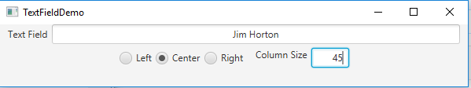

#  TextFieldDemo Excercise 16_6

This assignment is to write a program that sets the horizontal-alignment and column-size properties of a text field dynamically, as shown in Figure 16.38a.

## Example Output

## Analysis Steps
This assignment is to create a textfield for typing that havethe width modified by a second textfield setting the width to the input number.

### Design
Create each piece.
Add each piece to appropriate panes.
Add panes to scene.
Finaaly add functionality to the radio buttons and to the setColSize textfield.

### Testing
This was a test as you go.

## Do not change content below this line
## Adapted from a README Built With
*  [Dropwizard](http://www.dropwizard.io/1.0.2/docs/) - The web framework used
*  [Maven](https://maven.apache.org/) - Dependency Management
*  [ROME](https://rometools.github.io/rome/) - Used to generate RSS Feeds

## Contributing
Please read
[CONTRIBUTING.md](https://gist.github.com/PurpleBooth/b24679402957c63ec426
) for details on our code of conduct, and the process for submitting pull 
requests to us.

## Versioning
*  **Billie Thompson** - *Initial work* -
[PurpleBooth](https://github.com/PurpleBooth)

See also the list of
[contributors](https://github.com/your/project/contributors) who
participated in this project.

## License

This project is licensed under the MIT License - see the 
[LICENSE.md](LICENSE.md) file for details

## Acknowledgments

*  Hat tip to anyone who's code was used
*  Inspiration
*  etc
