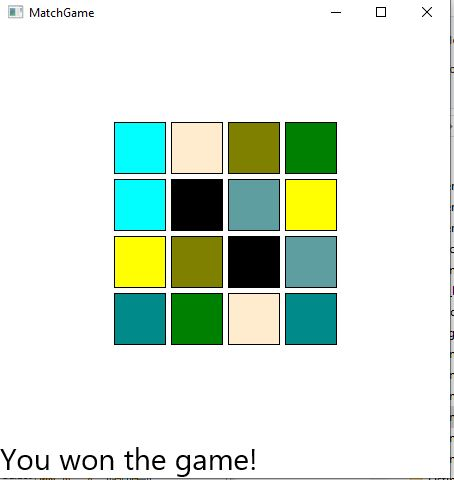

# Project Title

Create a matching color matching game using colors!

## Example Output

This image will display as your example output. Name the image README.jpg in your project folder.



## Analysis Steps

1) Define the rules and logic of the game - helps figure out which variables to declare

2) Create a GUI for our game to display onto and for our images to display to

3)  Create methods that invoke the rules of the game

4) launch args in the main method to display the program

### Design

How did you approach your program design? Did you use multiple classes to define various objects?


```
Originally we wanted to display pictures instead of what we had to go with.  

We Created a main class and also a created a secondary class to create the colors and their methods.  Also introduced path
transition in the secondary class.  
```

### Testing

A step by step series of examples that you developed to properly test the program. 

Make sure Program launches without errors

```
No error in terminal
```
Try to match two sqaures

```
If they don't match, they fade.  If they do match, they stay matched/solved
```
Complete the game

```
 Make sure all squares are matched.  If you're score is good enough you'll see a message pop up saying you wont the game
```

## Notes

We would love to use images instead of filling shapes with colors, however we were impactecd with time constraints with turning this assignment in.  Maybe one of these days we will figure out the logic and make this into something more complex than using built in methods of shapes.  

## Do not change content below this line
## Adapted from a README Built With

* [Dropwizard](http://www.dropwizard.io/1.0.2/docs/) - The web framework used
* [Maven](https://maven.apache.org/) - Dependency Management
* [ROME](https://rometools.github.io/rome/) - Used to generate RSS Feeds

## Contributing

Please read [CONTRIBUTING.md](https://gist.github.com/PurpleBooth/b24679402957c63ec426) for details on our code of conduct, and the process for submitting pull requests to us.

## Versioning

We use [SemVer](http://semver.org/) for versioning. For the versions available, see the [tags on this repository](https://github.com/your/project/tags). 

## Authors

* **Billie Thompson** - *Initial work* - [PurpleBooth](https://github.com/PurpleBooth)

See also the list of [contributors](https://github.com/your/project/contributors) who participated in this project.

## License

This project is licensed under the MIT License - see the [LICENSE.md](LICENSE.md) file for details

## Acknowledgments

* Hat tip to anyone who's code was used
* Inspiration
* etc
